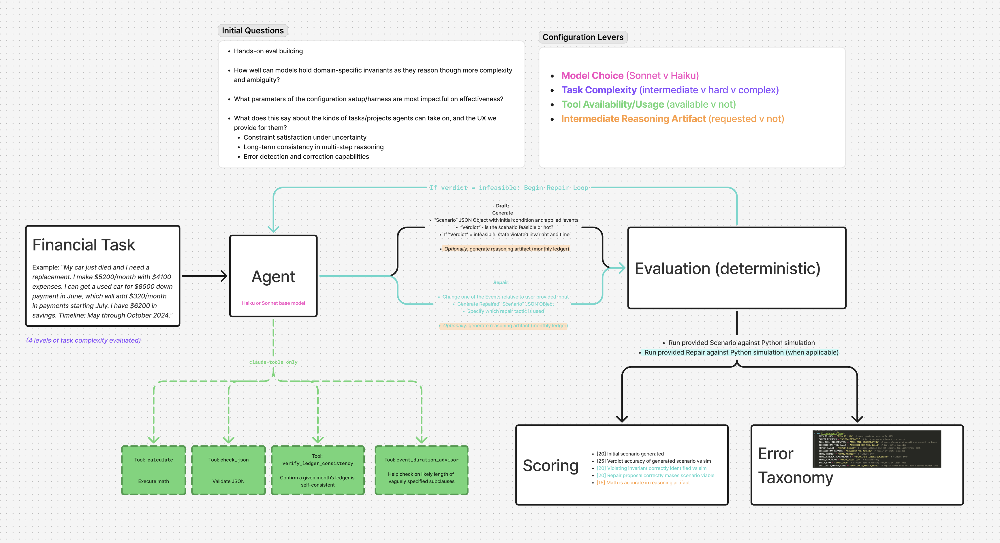

# Financial Reasoning Evaluation Framework

I built this framework to get hands-on with applied model reliability work, with a specific bent towards questions about what the current generation of models may be capable of as agents with minimal harnessing.

I wanted to test whether models can accurately hold domain-specific invariants implicitly while reasoning through increasingly complex scenarios, and how easily they can connect the dots from natural language descriptions to domain-specific reasoning models.

The core mechanism: deterministic financial simulation as ground truth, enabling isolation of model reasoning failures from evaluation failures.

The task: Given a natural language financial scenario (e.g., "I have $1000 cash, earn $2000/month, but need to buy a $3000 car next month"), models must generate a structured JSON scenario, determine if it's feasible within specified constraints (liquidity floors, money conservation), and if infeasible, propose a specific repair from a list of options (timing shifts, amount adjustments, baseline changes).

I started in finance because the invariants are extremely clear (cash conservation, liquidity floors, temporal consistency). This let me systematically test how various model configurations and evaluation choices affect the ability to maintain these constraints — and where these patterns may or may not generalize.

## Experimental Framework



The diagram shows the complete experimental pipeline: natural language financial tasks are processed by agents under different configurations (model, tools, ledger requirements, task complexity), then evaluated against deterministic ground truth simulation to isolate model reasoning failures from evaluation artifacts.

## Key Findings

Across 696 executions, a few patterns emerged. Overall - it seems that the only model configuration that helped was Sonnet over Haiku, as expected. Other architectural / harness setups (tools, or requesting intermediate reasoning artifacts) were neutral or negative on performance.

- **Task complexity dominates everything**: The 8.9-point gap between v4-advanced and v2-intermediate tasks is larger than all other factors combined. This was interesting because the 'advanced' tasks were those with less clear wording that connected the user input to the domain-specific task. This suggests that translating general domain knoweldge into a specific task shape has large dependency on the way the input is communicated, which has implications on how agentic systems might be scoped in production — it seems fairly critical that 'task shape' be decided as clearly as possible and is likely to the most sensitive juncture to good design (relative to e.g. other config options).

- **Tools barely help despite seeming obvious**: Only -0.7pp average effect, with high variability masking large task-specific benefits and failures. Tool integration creates unpredictable performance patterns rather than consistent improvements, challenging assumptions about computational assistance. That said, I didn't spent much time optimizing the tools for this exploration and might have designed suboptimal ones.

- **Requesting intermediate reasoning artifacts hurt across all conditions**: Requiring intermediate reasoning artifacts caused -8.4pp performance drop, contradicting my intuition about the beneifts of asking models to articulate their reasoning. My mechanistic analysis revealed this transforms the cognitive task from scenario design to arithmetic computation which seems to have distracted the model and it got more of its core cognitive work wrong. This might also be something that has less negative impact with models better at reasoning, which I didn't test here due to cost considerations.

**Effect Size Hierarchy** (from 696 task executions across 2×2×2×3 factorial design):

1. **Task Complexity**: -8.9pp (v4 vs v2) - largest effect
2. **Ledger Requirement**: -8.4pp - strong negative effect
3. **Model Choice**: +5.2pp (Sonnet vs Haiku) - moderate positive effect
4. **Tool Access**: -0.7pp - minimal effect

_See [FINDINGS.md](./FINDINGS.md) for detailed methodology and results._

## What I Was Trying to Learn

I designed this framework to get hands-on with fundamental questions about model reliability, with a specific bent towards questions about what the current generation of models may be capable of as long-running agents with minimal harnessing.

**Core Research Questions**:

- How well can models hold domain-specific invariants as they reason through more complexity and ambiguity?
- What parameters of the configuration setup/harness are most impactful on effectiveness?
- What does this say about the kinds of tasks/projects agents can take on, and the UX we provide for them?

**Specific Capabilities Under Test**:

- Constraint satisfaction under uncertainty: Can models maintain financial invariants (cash conservation, liquidity floors) when scenario details are incomplete or ambiguous?
- Long-term consistency in multi-step reasoning: Do models preserve constraints across the full reasoning chain from natural language → JSON → feasibility analysis → repair?
- Error detection and correction capabilities: When initial scenarios violate constraints, can models identify the specific violation type and propose targeted repairs?

**Methodological Goals**:

- Distinguish model limitations from evaluation framework failures through deterministic ground truth
- Isolate the effects of tools, intermediate artifacts, model choice, and task complexity through factorial design
- Understand interaction effects that single-condition evaluations would miss

The factorial design (2 models × 2 tool configurations × 3 task complexity levels × 2 ledger conditions × 3 runs) enables systematic attribution of performance differences to specific factors rather than confounded variables.

## Quick Start

```bash
pip install -r requirements.txt
export ANTHROPIC_API_KEY=your_key

# Run systematic comparison
python -m workbench run-comparison \
  --models claude,claude-tools \
  --task-sets tasks/v3-tasks-with-ledger \
  --runs 3

# Single task for debugging
python -m workbench run-single tasks/v2-intermediate/apartment_overlap.json --model claude
```

## Architecture

| Component       | Purpose                                                   |
| --------------- | --------------------------------------------------------- |
| `simulate.py`   | Deterministic ledger engine (ground truth)                |
| `invariants.py` | LIQUIDITY_FLOOR, MONEY_CONSERVATION, TEMPORAL_CONSISTENCY |
| `agents.py`     | Two-turn loop: generate → validate → repair               |
| `comparison.py` | Factorial A/B testing infrastructure                      |
| `scoring.py`    | Partial credit scoring across 5 dimensions                |

Traces written to `traces/<session_id>/`, comparison reports to `reports/`.

## Design Implications & Open Questions

**What this suggests for building reliable agents**:

**Task scoping matters most**: The 8.9pp complexity gap exceeds all infrastructure choices combined. For reliable agents, constraining task scope and ensuring clear input context matters way more than picking the "best" model or tools.

**System Architecture Patterns**:

- **Context specification interfaces**: UX should help users naturally constrain scenario scope rather than encouraging comprehensive descriptions. Systems should actively guide toward simpler, well-specified inputs.
- **Subagent orchestration with clarification loops**: The high tool variability suggests agents should delegate uncertain computations to specialized subagents rather than trying to do everything inline.
- **Know when to ask for help**: The predictable degradation patterns (90% → 60% success) suggest systems can detect when they're approaching their limits and proactively request human oversight.
- **Queue complex reasoning for review**: Rather than demanding immediate structured responses, systems should probably queue complex reasoning for async review.

**Open questions I'm still thinking about**:

- Do these patterns (complexity >> tools >> model) hold across other structured reasoning domains?
- Can tool integration be redesigned to reduce rather than amplify performance variance?
- What level of task complexity enables reliable invariant maintenance for different applications?
- How should agent systems detect and communicate when they're approaching their limits?

The framework methodology—factorial comparison with deterministic ground truth—felt like the right way to get empirical answers to these reliability questions.

---

**Detailed technical analysis**: [FINDINGS.md](./FINDINGS.md)
